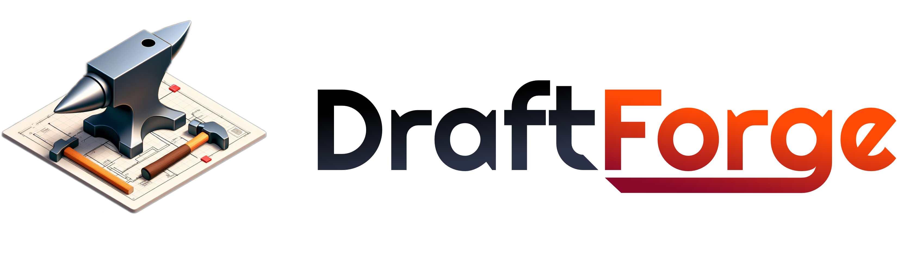
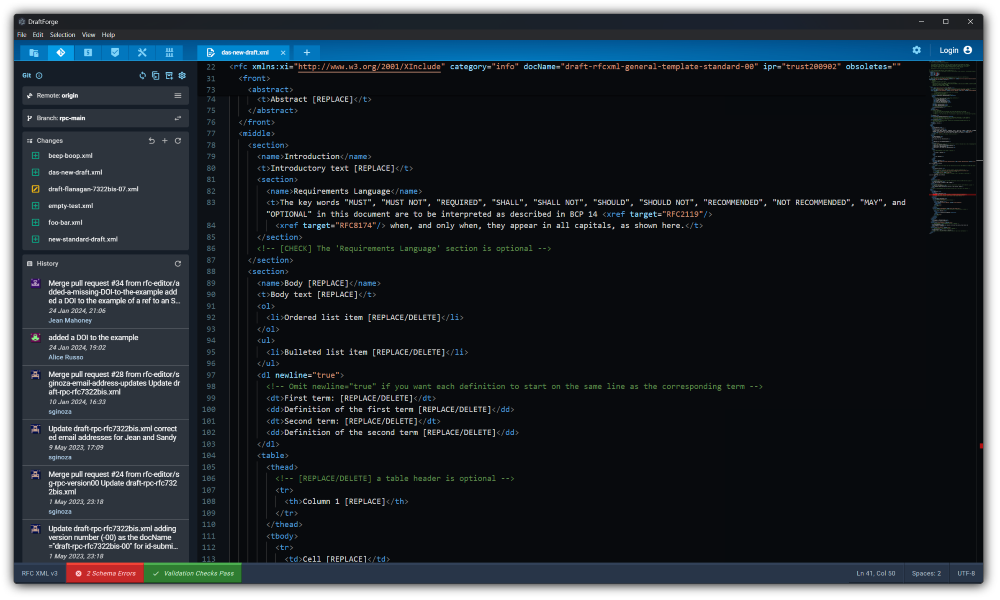

<picture>
  <source media="(prefers-color-scheme: dark)" srcset="docs/assets/logo-text-dark.png">
  
</picture>

#### A fully featured editor to write, review and publish Internet Drafts / RFCs.

- [Install](#install)
  - [Supported Platforms](#supported-platforms)
- [Development](#development)
  - [Prerequisites](#prerequisites)
  - [Setup](#setup)
  - [Build](#build)

---

# Install

Simply download the [latest release](https://github.com/ietf-tools/editor/releases/latest) for your platform.

## Supported Platforms

- Linux (x64, arm64)
- macOS (Intel, Apple Sillicon)
- Windows (x64, arm64)

# Development

## Prerequisites

- Git
- [Node.js](https://nodejs.org/en/download/) `20.x` or later

## Setup

- Clone the repository
- Install NPM dependencies: `npm install`
- Run in dev mode: `npm run dev`

## Build

- Run `npm run build` to build a binary for your platform.

Once the build succeeds, the executable will be located in `dist/electron/Packaged`.
